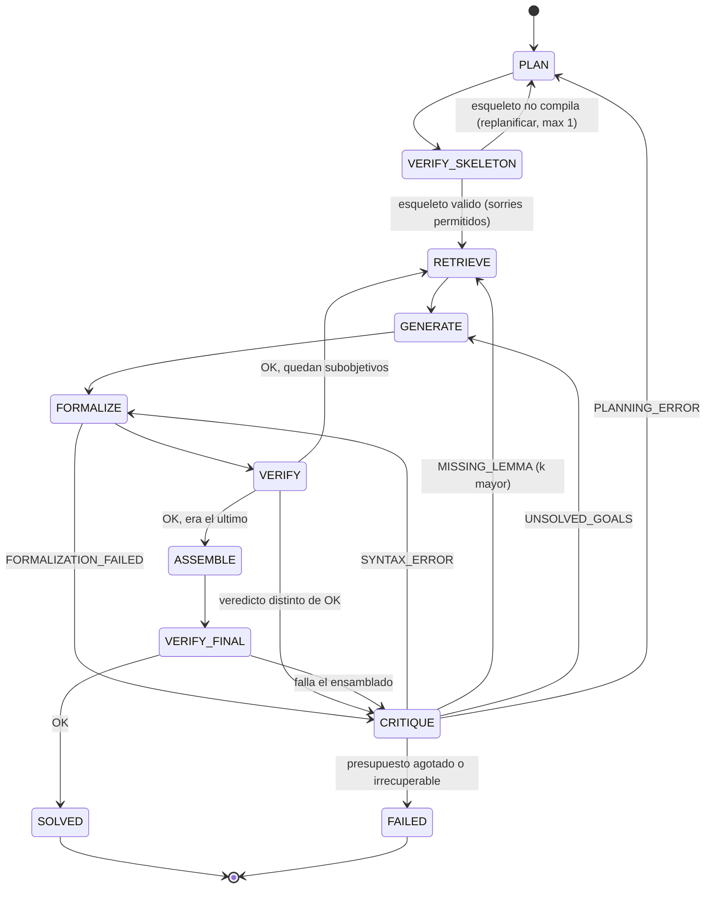

# Documento de diseño — Sistema multiagente de resolución matemática verificada

Entregable oficial semanas 1–2. Compañeros: `decisions.md` (elecciones congeladas),
`related-work.md` (marco teórico), `contracts/` (RNF-4), `../prompts/` (v0).

---

## 1. Premisa

Generar y verificar son regímenes asimétricos. Un LLM produce derivaciones plausibles y falsas,
y su confianza autoreportada no correlaciona con corrección. El kernel de Lean 4 decide
corrección en tiempo acotado y sin ambigüedad. El sistema explota la asimetría: la generación es
flexible y barata de equivocarse, la aceptación es rígida.

**Criterio único de éxito:** un problema está resuelto si y solo si el kernel acepta la prueba
ensamblada, sin `sorry` y sin axiomas fuera del conjunto permitido.

## 2. Agentes (seis, RNF-4)

| Agente | Entrada | Salida | Contrato |
|---|---|---|---|
| Planificador | enunciado NL + `formal_statement` | esqueleto Lean con `sorry` por subobjetivo | `contracts/planner.schema.json` |
| Recuperador | subobjetivo (texto + tipo Lean) | k lemas de Mathlib | `contracts/retriever.schema.json` |
| Generador | subobjetivo + lemas | n bocetos de prueba en NL/pseudo-táctica | `contracts/generator.schema.json` |
| Autoformalizador | boceto + lemas | bloque de tácticas Lean 4 | `contracts/autoformalizer.schema.json` |
| Verificador | código Lean | veredicto de 7 valores | `contracts/verifier.schema.json` |
| Crítico | veredicto + error crudo + historial | acción de recuperación | `contracts/critic.schema.json` |

El Verificador es **determinista** (no es un LLM). Se le da contrato igual que a los demás
porque su salida cruza la frontera entre módulos, y el RNF-4 aplica a la frontera, no al
mecanismo que hay detrás.

## 3. Grafo de estados

Los seis estados de la §6.2 más dos que la propuesta original omite: `VERIFY_SKELETON` y el par
`ASSEMBLE` / `VERIFY_FINAL`.



### 3.1 Por qué `VERIFY_SKELETON`

El Planificador no emite una lista en prosa: emite Lean 4, con un `have` por subobjetivo y un
`sorry` en cada uno.

```lean
theorem mathd_algebra_478 (b h v : ℝ) (h₀ : 0 < b ∧ 0 < h ∧ 0 < v)
    (h₁ : v = 1/3 * (b*h)) (h₂ : b = 30) (h₃ : h = 13/2) : v = 65 := by
  have step1 : b * h = 195 := by sorry
  have step2 : v = 1/3 * 195 := by sorry
  linarith [step1, step2]
```

Si ese bloque compila (con advertencia de `sorry`), entonces **los subobjetivos implican el
teorema**: la descomposición es lógicamente válida antes de intentar probar nada. Si no compila,
el Planificador falló y se replanifica. El RF-1 deja de ser una promesa y pasa a ser
mecánicamente comprobable. Es el punto que más diferencia este diseño de uno promedio.

### 3.2 Por qué `ASSEMBLE` / `VERIFY_FINAL`

Un subobjetivo verificado en aislamiento no garantiza que el teorema ensamblado compile: cambian
el contexto local, los nombres de hipótesis y la elaboración de universos. `ASSEMBLE` sustituye
cada `sorry` por su prueba y recompila el teorema completo. **Solo `VERIFY_FINAL` produce
`SOLVED`.**

### 3.3 Estado

`GraphState` (TypedDict de LangGraph), con checkpoint tras cada nodo:

```
problem_id, formal_statement, nl_statement
skeleton: str | None
subgoals: list[Subgoal]          # name, type, status, proof, attempts
current: int
attempts: list[Attempt]          # historial completo, RF-6
budget: Budget
verdict: Verdict | None
run_id, config, seed
```

`attempts` guarda el historial íntegro (prompt, respuesta, error de Lean crudo). Es lo que
alimenta el apéndice de trazas del informe y la taxonomía de errores de la §8.3.

## 4. Formalización del recuperador (§6.4)

Sea **M** el corpus de premisas de Mathlib y *e*: texto → R^d el codificador (BGE-M3, d = 1024).
Para un subobjetivo *g*, el recuperador devuelve el subconjunto de tamaño *k* que maximiza la
similitud coseno acumulada:

$$R_k(g) \;=\; \operatorname*{arg\,max}_{S \subset \mathcal{M},\; |S| = k} \; \sum_{\ell \in S} \frac{\langle e(g),\, e(\ell) \rangle}{\lVert e(g) \rVert \, \lVert e(\ell) \rVert}$$

Como el máximo de una suma sobre subconjuntos de tamaño fijo se alcanza tomando los *k* términos
mayores, R_k(g) es exactamente el top-*k* por coseno y se resuelve en una sola consulta.

**Implementación.** Se normaliza ê(x) = e(x)/‖e(x)‖₂ al indexar y al consultar. Entonces
⟨ê(g), ê(ℓ)⟩ es el coseno, y un `faiss.IndexFlatIP` sobre ê devuelve R_k(g) por producto interno
exacto. `IndexFlatIP` es búsqueda exhaustiva: sin aproximación, luego ningún error de
recuperación es atribuible al índice. Con |M| ≈ 2·10⁵ premisas sobra en velocidad.

**Representación de ℓ.** `"{nombre} : {tipo_pretty_printed}\n{docstring}"`. El tipo es la señal
fuerte; la docstring tiende el puente NL → formal.

**Elección de k.** No se fija por intuición: sale de la curva recall@k de la semana 6, usando
como ground truth las premisas que LeanDojo anota como realmente usadas en cada prueba de
Mathlib.

## 5. Veredictos del verificador

Siete valores. `SORRY` y `AXIOM` son los que impiden que el sistema se autoengañe.

| Veredicto | Condición | Por qué existe |
|---|---|---|
| `OK` | compila, sin sorries, axiomas ⊆ permitidos | única vía a `SOLVED` |
| `SORRY` | compila pero quedan `sorry` | sin esto, un `sorry` cuenta como prueba y la métrica principal es falsificable |
| `AXIOM` | usa axiomas fuera de `{propext, Classical.choice, Quot.sound}` | `axiom foo : False` demuestra cualquier cosa, y compila |
| `SYNTAX_ERROR` | error de parseo o elaboración | reintento barato, mismo boceto |
| `MISSING_LEMMA` | `unknown identifier` / `unknown constant` | el modelo alucinó un nombre de lema; señal directa para el RAG |
| `UNSOLVED_GOALS` | metas abiertas al cierre de la prueba | el boceto está mal, no la sintaxis |
| `TIMEOUT` | excede el límite de pared | `decide` y `simp` pueden no terminar |

La §8.3 los agrupa en cinco clases para la taxonomía de errores del informe: sintaxis, lema
faltante, meta sin cerrar, timeout, error de planificación.

## 6. Configuraciones de la ablación (§8.2)

| # | Configuración | Bandera |
|---|---|---|
| 1 | Línea base A: un prompt → Lean, una llamada | `--config baseline_a` |
| 2 | Línea base B: CoT en lenguaje natural, sin verificación, con autoevaluación | `--config baseline_b` |
| 3 | Multiagente sin RAG y sin Crítico | `--config agents_only` |
| 4 | Multiagente con RAG, sin Crítico | `--config no_critic` |
| 5 | Sistema completo | `--config full` |

La línea base B pide al modelo que juzgue su propia prueba. Ese juicio autoreportado es el dato
de la métrica **falsos positivos evitados**: después se formalizan esas mismas pruebas y se mide
cuántas de las declaradas correctas rechaza el kernel. Es el resultado que va en el abstract.

**Banda útil.** Si los problemas son demasiado difíciles, las cinco configuraciones dan 0% y la
ablación no mide nada; si son triviales, dan 100% y tampoco. Meta: el sistema completo entre 30%
y 60% en dev.

## 7. Logging (RF-7)

Una línea JSONL por invocación de agente en `runs/{run_id}.jsonl`:

```
run_id, config, problem_id, agent, attempt, model, temperature, seed,
prompt_tokens, completion_tokens, latency_ms, decision, verdict
```

Encabezado de cada archivo (RNF-2): semilla, commit de Mathlib, versión del modelo de
embeddings, versión y temperatura del LLM, commit del repositorio.

Ninguna métrica se calcula a mano: todas se agregan desde estos archivos.

## 8. Riesgos abiertos

1. **Solapamiento Crítico ↔ autocorrección del prover** (ver `decisions.md` §D2). Mitigado
   desactivando la autocorrección interna; declarado en *Limitations*.
2. **Subpoder estadístico.** Con n ≈ 50, cinco configuraciones por pares y Bonferroni
   (α efectivo ≈ 0.005), McNemar probablemente no dé significancia. El estudio se declara
   exploratorio y se reportan tamaños de efecto e intervalos de Wilson.
3. **Montaje de Lean + Mathlib en un Space de Gradio** (varios GB, arranque lento). Salida
   declarada: el Space reproduce trazas ya ejecutadas y verifica en vivo solo problemas
   cacheados.
